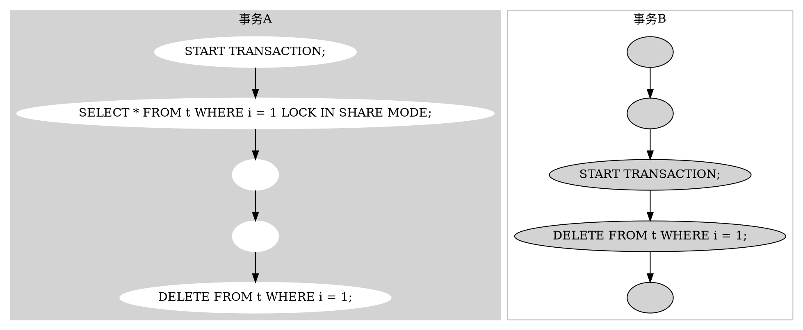

# InnoDB中的死锁
## 死锁例子
### 准备
```
mysql> CREATE TABLE t (i INT) ENGINE = InnoDB;
Query OK, 0 rows affected (1.07 sec)

mysql> INSERT INTO t (i) VALUES(1);
Query OK, 1 row affected (0.09 sec)
```
### 死锁场景

1. 事务A执行SELECT时，获取S锁
2. 事务B执行DELETE，需要获取X锁，放于X锁等待队列以等待事务A释放S锁（添加了S锁后只能再加S锁，而不能加X锁）
3. 事务A执行DELETE，需要从S锁升级为X锁，放于X锁等待队列中事务B之后
4. 这样事务B等待事务A释放S锁，事务A等待事务B使用并释放X锁。发生死锁
### 死锁之后
发生了死锁后，InnoDB会在其中一个事务中提示错误信息，并释放此事务持有的锁。这样另一个事务就得以顺利进行了。
```
ERROR 1213 (40001): Deadlock found when trying to get lock;
try restarting transaction
```

## 参考
https://dev.mysql.com/doc/refman/5.7/en/innodb-deadlock-example.html